# at-field

`at-field` measures how much of a theme's vocabulary a transcript uses. Give it a transcript and a theme, for example `--theme "animals"`, and it returns a score with the matches behind it.

```bash
at-field transcript.srt --theme "economy"
```



*A replay of two real runs. The model's wait and the report path are trimmed.*

Transcripts can come from any tool: `whisper.cpp`, a transcription service, YouTube captions. at-field starts from the text.

## Reading the score

Every run reports a **lexical saturation** score: the share of the theme's vocabulary that shows up in the transcript (distinct field words found ÷ field size), with the raw counts and a matches-per-1,000-words density beside it. It works best on a theme that sits beneath the transcript's subject, such as economy in a nature documentary or conflict in a cooking show.

The report says whether the score falls below, between, or above two boundaries (default 10% and 70%). The defaults are arbitrary starting points; set your own with `--saturation-low` and `--saturation-high`. What a position means is up to you.

## Install

Requires Node.js 22+ and [Ollama](https://ollama.com) running locally. Ollama expands the theme into a lexical field; nothing is bundled and no API key is needed.

```bash
ollama pull qwen2.5:3b
npm install -g at-field
```

The default model is about 1.9 GB and downloads once. If it is missing, at-field shows its size and offers to pull it. A run with no terminal (a script or CI job) starts no download and prints the `ollama pull` command instead.

To try it without installing, run it through `npx`:

```bash
npx at-field transcript.srt --theme "economy"
```

`npx` fetches the package on first use, so the first start takes longer. Set up Ollama and pull the model first, because `npx` fetches only at-field.

To run from source instead:

```bash
git clone https://github.com/promethee/at-field.git
cd at-field
npm install
npm run build
npm link
```

`at-field` talks to Ollama's default local server (`http://localhost:11434`). Set the `OLLAMA_HOST` env var if yours runs elsewhere.

## Usage

```bash
at-field <transcript-file> --theme "<theme>" [options]
```

Accepts `.srt` and `.vtt` (timestamps are kept in the report) or plain text (no timestamps).

| Flag | Default | Description |
|---|---|---|
| `--theme <value>` | *(required)* | Theme to expand into a lexical field and score against the transcript. |
| `--lexic <path>` | none | Wordlist file to use instead of model expansion, used as written. `--theme` still names the analysis. |
| `--language <code>` | detected from the transcript | Transcript's language, for example `en` or `fr`. The lexical field is written in this language. |
| `--model <name>` | `qwen2.5:3b` | Ollama model for theme expansion. Offers to `ollama pull` it when missing. Smaller models such as `qwen2.5:0.5b` run faster and give weaker fields outside English. Larger ones such as `mistral` may do better in French. |
| `--field-size <n>` | `25` | How many words to keep when the model expands the theme (5 to 100). Raise it for long transcripts. Cannot be combined with `--lexic`. |
| `--stem-length <n>` | `5` | Leading letters that identify a word's stem, from 3 to 12, or 0 to turn stem filtering off. Words sharing a stem count as one word ("voyage" and "voyageur"), and words sharing a stem with the theme are dropped ("economic" for "economy"). Lower it to merge more forms, raise it to merge fewer. Cannot be combined with `--lexic`. |
| `--saturation-low <pct>` | `10` | Low boundary for the saturation score, in percent. |
| `--saturation-high <pct>` | `70` | High boundary for the saturation score, in percent. |
| `--verbose` | off | Also print the full Markdown report and the long limitation notices. |
| `--quiet` | off | Print only the report path. Cannot be combined with `--verbose`. |
| `--version` | off | Print the version and exit. |

Each run writes a Markdown report next to the input transcript.

## Philosophy

Limitations that apply to a run (missing timestamps, a thin field) print as one notes line, and the report file carries the full disclaimers, including that accuracy depends on the tool that made the transcript. Progress and notes go to stderr, so stdout can be piped. Theme expansion runs through a local Ollama server, with no cloud API calls and no per-run cost. Output is Markdown.

## Scope

at-field measures one theme in one transcript per run and writes one report. Other jobs belong to other tools: a summarizer for what a text covers, a transcription tool such as Whisper or Vibe for audio, and a topic-modelling tool for discovering themes. It keeps no project state between runs.

## Known limitations

- The lexical field is written in the transcript's language (detected, or set with `--language`), so `--theme` can be in any language. Field quality depends on the model, and small models are weak outside English, which is why `qwen2.5:3b` is the default.
- Matching is literal. A word matches only in the form listed, so "jeu" and "jeux" count separately. Include the forms you want through `--lexic`.
- Plain-text input carries no timing, so the timestamped-occurrence log is empty. Use `.srt` or `.vtt` input to keep it.
- A field under 8 words triggers a thin-field notice, since the result then reads more like keyword spotting than a broad thematic measure.

## Performance

Theme expansion is the slow step, and its speed depends on the hardware running Ollama. Ollama uses a supported GPU automatically, and a GPU is recommended if you run at-field often. On a CPU-only machine, the default 3B model took about 2 to 5 minutes per run in testing. A smaller model (`--model qwen2.5:0.5b`) runs faster and gives weaker fields outside English. A wordlist (`--lexic`) skips expansion and answers in seconds.

## License

MIT

## Made with AI, designed by human

Built through pairing with Claude Code. A human made every design decision, trade-off and rejected alternative, all recorded in `INTENT.md`; the AI handled implementation.
